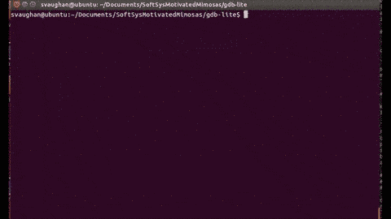

## GDB-Lite

A lightweight, limited functionality debugger for C code.

### Authors

- Deniz Celik
- Chong Swee Goh
- Sawyer Vaughan
- Chris Wallace

Our project is to create a program that replicates portions of [GDB](https://www.gnu.org/software/gdb/). GDB is a software program that allows developers to debug programs and give many pieces of useful information about the execution and state of the program.

See more on our [project website](http://sawyervaughan.com/SoftSysMotivatedMimosas).

### Getting Started

`cd` into the `gdb-lite` directory and run the following make commands to compile or clean the project:

```bash
make gdb-lite # Makes a gdb-lite executable in the gdb-lite directory
make clean # Removes temporary object files for a clean rebuild
```

At the moment, this will only work on 64-bit versions of Linux.

### Usage

- To run GDB lite, compile an executable you wish to debug. Then run `./gdb-lite MY_EXEC`
- When you are in the `gdb-lite` console, you can use any of the following functions:

```bash
run *args here* # Runs the file with the given arguments
quit # Exits the gdb-lite executable
func # Prints the address of a given function
var # Prints the address of a global variable (If in breakpoint, prints value also)
symtable # Prints the symtable for the file
break # Allows you to enter an address to create a trap instruction at

###
# Only available in a breakpoint
###

dump # Prints the contents of the stack
resume # Will resume execution of the file
```

To get an address for the `break` command, use the print command to print the address of the function you would like to break on first.



### Adding new code

This debugger will only work on 64 bit Linux. Modifying it to work for 32 bit Linux should be trivial, but it would be very difficult to get this debugger to work on a Mac. 

To add new code to the gdb-lite project, follow the directions below. Unless otherwise stated, assume all directories are relative to the gdb-lite/ directory (i.e. when it says src/ directory, it means gdb-lite/src/).

To add new code, write a source .c file in the src/ directory. Add a header as a .h file in the include/ directory that has declarations for the functions that need to be imported into `gdb-lite.c`.

Next, add `#include "filename.h"` to `gdb-lite.c`.

Next, we have to add all of the new files to the Makefile. Edit the src/Makefile file. Add `c_filename.o` to the `_OBJ` variable, and `h_filename.h` to the `_DEPS` variable.


